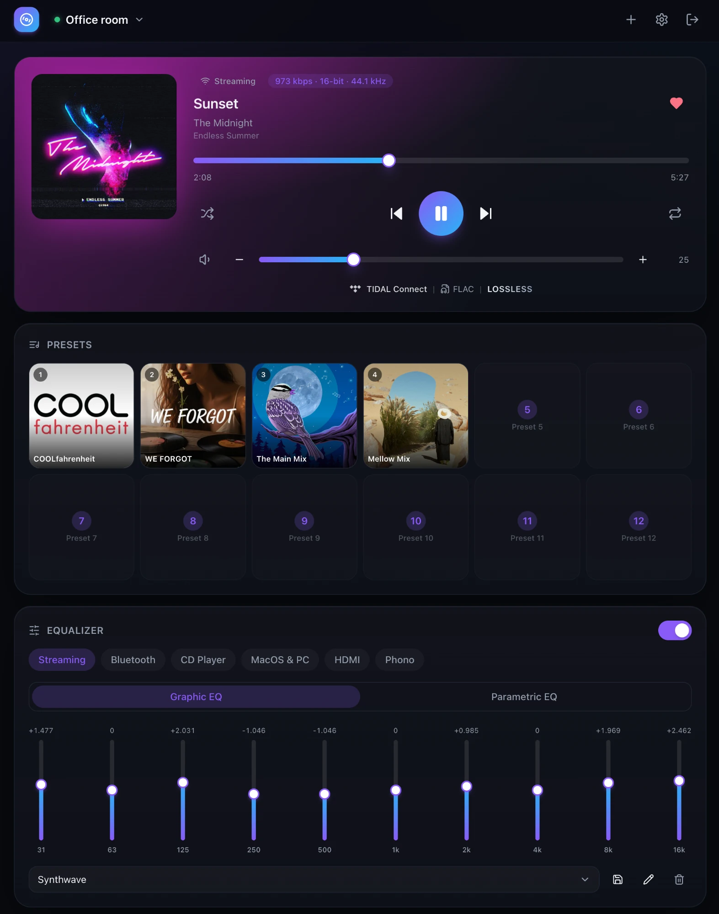
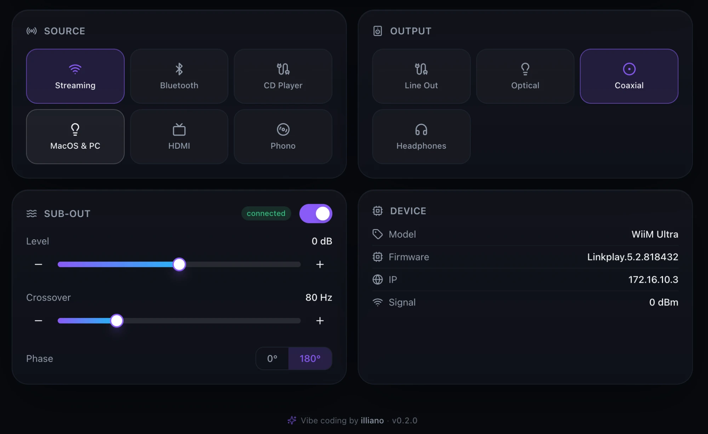

<div align="center">

# 🎵 Wiim Dashboard

**A self-hosted, dark-themed web dashboard to monitor and control your [WiiM](https://www.wiimhome.com/) (LinkPlay) audio devices.**

Now-playing & transport · EQ · sub-out · source/output switching · presets with artwork · amp temperature — built for phone, tablet and desktop, packaged as a single Docker container, and hardened to sit safely behind your own reverse proxy.

[](https://github.com/illianoaoi/Wiim-Dashboard/actions/workflows/ci.yml)


<br/>


<br/>

<br/>


</div>

---

> [!IMPORTANT]
> The WiiM device HTTP API has **no authentication** and uses a self-signed certificate. This app **never exposes the device** — a server-side proxy is the only thing that talks to it, behind login + CSRF + optional Cloudflare Turnstile, and SSRF-guarded so it can only reach LAN hosts.

## Table of contents

- [Features](#features)
- [Supported devices](#supported-devices)
- [How it works](#how-it-works)
- [Tech stack](#tech-stack)
- [Quick start (Docker)](#quick-start-docker)
- [First run](#first-run)
- [Adding devices](#adding-devices)
- [Configuration](#configuration)
- [Public access / reverse proxy](#public-access--reverse-proxy)
- [Cloudflare Turnstile](#cloudflare-turnstile)
- [Last.fm scrobbling](#lastfm-scrobbling)
- [Security model](#security-model)
- [Development](#development)
- [Project structure](#project-structure)
- [Troubleshooting](#troubleshooting)
- [Contributing](#contributing)
- [Support](#support)
- [License & credits](#license--credits)

## Features

| Area | What you get |
|---|---|
| **Now playing** | Title / artist / album (hex-decoded), album art (proxied), live progress, seek, play/pause, prev/next, shuffle & repeat; current track shown in the browser tab title |
| **Album-art theming** | The card tints to the cover's dominant colour with a matching glow, crossfading per track (monochrome covers stay neutral) |
| **Vinyl view** | Toggle the cover for a spinning vinyl record — the cover becomes the centre label, the platter eases up to speed and slows to a stop like a real turntable, and Phono inputs default to it |
| **Kiosk / wall mode** | A chrome-free fullscreen now-playing view around the spinning vinyl — for wall-mounted tablets and vinyl-wall displays |
| **Synced lyrics** | A lyrics view that auto-scrolls to the current line (tap a line to seek), via [LRCLIB](https://lrclib.net/) — free, no key |
| **Source-aware art** | Physical inputs (Optical, Line-in, …) show the source icon instead of stale cover art |
| **Quality readout** | Bit rate · bit depth · sample rate, e.g. `1411 kbps · 16-bit · 44.1 kHz`, shown as a clean segmented chip |
| **Stream info** | Detected streaming service + logo (Spotify / TIDAL / Qobuz Connect, AirPlay, DLNA, Bluetooth, in-app services) · inferred codec · graded tier — gold **Hi-Res Lossless**, silver **Lossless**, grey **Lossy** |
| **Last.fm scrobbling** | Server-side background scrobbler that runs **even with the dashboard closed**; per-device toggle; scrobbles every source (incl. vinyl/optical/USB) |
| **Last.fm Love** | ❤ button on the Now Playing card — loves/unloves the track on Last.fm (WiiM has no native favorite command) |
| **Last.fm stats** | Top artists & tracks (7 days / month / all-time) + total scrobbles, when Last.fm is connected |
| **Sleep timer** | 🌙 set a 15–120 min timer that pauses the device — runs **server-side**, so it fires even with the dashboard closed |
| **Volume** | Slider **plus −/+ buttons** (touch-friendly on iPad) |
| **Presets** | Square artwork tiles in a 2×6 grid (count auto-detected per model), tap to play; names + art from `getPresetInfo`; horizontal-scroll on phones |
| **EQ** | Per-source **Graphic (10-band) + Parametric** EQ, plus enable/disable and named presets |
| **Sub-out** | Level (−15…+15 dB), crossover (30–250 Hz), phase, enable — with −/+ buttons |
| **Temperature** | CPU + board °C gauge — **amp models only** |
| **Device info** | Model, firmware, IP, connection — plus a **Wi-Fi signal** indicator (bars from RSSI, or "Ethernet") and a connected **USB DAC** name |
| **Source switching** | Auto-detected from the device's `plm_support` bitmask; **auto-imports the input names you set in the WiiM app** and hides inputs you've disabled there; rename per device too |
| **Output switching** | Optical / line-out / coax (+ headphones on Ultra) |
| **Multiple devices** | Add by IP or LAN scan; per-device **capability detection** shows only what each model supports |
| **Auth & security** | Single-admin login (Argon2id), server sessions, optional TOTP 2FA, Cloudflare Turnstile, rate-limiting, CSRF, strict nonce-based CSP |
| **Deploy** | One Docker image, `docker compose up -d`, data in a named volume |

Every card is **capability-aware** — the Temperature card only appears on amp models, the Sub-out card only when the device answers `getSubLPF`, the Presets card only when the model exposes preset slots, and so on.

## Supported devices

Any WiiM / LinkPlay device that exposes the `httpapi.asp` HTTP API, including:

- **WiiM Mini, Pro, Pro Plus** — playback, EQ, source/output
- **WiiM Ultra** — + sub-out, output routing, presets, headphones out
- **WiiM Amp / Amp Pro / Amp Ultra** — + device temperature
- Other LinkPlay OEM streamers may work to varying degrees

> The dashboard controls devices over their network HTTP API, so non-networked WiiM accessories — e.g. the **Vibelink Amp** (a passive power amplifier) — can't be controlled here. Pair them with a WiiM streamer and control that.

Feature availability is detected per device at add time (and refreshable), so unsupported cards are simply hidden.

## How it works

```
 Browser ──https──> Your reverse proxy (Zoraxy/Caddy/Cloudflare) ──http──> Wiim Dashboard (Docker)
                                                                                   │ server-side only
                                                                                   ▼
                                                                       WiiM device(s) on the LAN
                                                                       https://<ip>/httpapi.asp
```

The Next.js server is the **only** component that talks to the device. The browser only ever calls the app's own authenticated API routes; the app proxies each command to the device over HTTPS (self-signed cert + the shared LinkPlay mTLS client cert), normalises the response, and returns clean JSON. See [ARCHITECTURE.md](ARCHITECTURE.md) for the full design and [docs/WIIM-API.md](docs/WIIM-API.md) for the device API mapping.

## Tech stack

- **[Next.js 15](https://nextjs.org/)** (App Router, TypeScript) — UI + server-side device proxy in one image (standalone output)
- **Tailwind CSS** + Radix UI primitives + Framer Motion + lucide icons
- **better-sqlite3** for users / sessions / devices / settings
- **@node-rs/argon2** password hashing · **otplib** TOTP
- Single multi-stage **Docker** image, ~250 MB runtime

## Quick start (Docker)

> 🆕 **New to Docker, or not very technical?** Follow the **[dead-simple, step-by-step install guide →](docs/EASY-INSTALL.md)** — no command-line experience needed. The rest of this section assumes some familiarity.

**Prerequisites:** Docker + Docker Compose, and your WiiM device(s) reachable on the LAN.

```bash
git clone https://github.com/illianoaoi/Wiim-Dashboard.git
cd Wiim-Dashboard

cp .env.example .env
# Edit .env — at minimum set AUTH_SECRET:
#   openssl rand -base64 48

docker compose up -d --build
```

Open `http://<host>:39446` and you'll be taken to a first-run setup page.

> **Testing over plain http (LAN IP)?** Set `COOKIE_SECURE=false` in `.env` so login cookies work without https. Behind https (recommended), leave it unset.

### Run the prebuilt image (no build)

Multi-arch images (`amd64` + `arm64`) are published to GHCR on every release:

```bash
docker run -d --name wiim-dashboard -p 39446:3000 \
  -e AUTH_SECRET="$(openssl rand -base64 48)" \
  -e COOKIE_SECURE=false \
  -v wiim-data:/data \
  ghcr.io/illianoaoi/wiim-dashboard:latest
```

Pin a version with `:0.3.0` instead of `:latest`. Behind https, drop `COOKIE_SECURE=false` and set `APP_ORIGIN`.

## First run

1. Open the app → **Setup** page → create your single admin account (Argon2id-hashed).
2. You're logged in and redirected to the dashboard.
3. Go to **Add device** to connect your first WiiM.

## Adding devices

- **By IP (recommended):** enter the device's LAN IP (e.g. `192.168.1.50`). The app probes it and saves its capabilities.
- **LAN scan:** on the Add-device page enter your network range (e.g. `192.168.1.0/24`) and **Scan** — the app probes every host in that /24 in parallel. This works inside Docker bridge networking (unlike SSDP multicast).
- **SSDP discovery** is also attempted, but only works when the container uses host networking (`network_mode: host` — see comments in `docker-compose.yml`).
- **Rename sources** per device on the Devices page. By default the dashboard imports the custom input names you set in the WiiM app (`getModeRename`); a name you set per-device here overrides the imported one.

## Configuration

All configuration is environment variables (see `.env.example`):

| Variable | Default | Purpose |
|---|---|---|
| `AUTH_SECRET` | — (required) | Server secret (≥16 chars). HMAC pepper for session tokens. `openssl rand -base64 48` |
| `APP_ORIGIN` | — | Public origin (`https://…`) for strict CSRF origin checks |
| `TRUST_PROXY` | `true` | Honour `X-Forwarded-For` / `-Proto` from your reverse proxy |
| `COOKIE_SECURE` | `true` in prod | Set `false` only for plain-http LAN testing |
| `DATA_DIR` | `/data` | SQLite + runtime data (mounted volume) |
| `PORT` | `3000` | Internal listen port (compose maps host `39446` → `3000`) |
| `TURNSTILE_SITE_KEY` / `TURNSTILE_SECRET_KEY` | — | Optional; can also be set in **Settings** |
| `WIIM_CLIENT_CERT_PATH` / `WIIM_CLIENT_KEY_PATH` | — | Optional mTLS override (a working LinkPlay cert is embedded) |
| `WIIM_DEVICE_CONCURRENCY` | `4` | Max concurrent `httpapi` requests per device — lower to `1`–`2` for older/flaky devices that choke on parallel bursts |

The dashboard's polling interval, Turnstile keys and per-device source names are managed in the **Settings** and **Devices** pages and stored in SQLite. **Last.fm scrobbling** is configured entirely in-app (Settings → Last.fm Scrobbling) — no new env var is needed.

## Public access / reverse proxy

The app serves plain HTTP on its port; **terminate TLS at a reverse proxy**. It ships behind host port `39446` by default.

**Zoraxy / Caddy / Traefik / Nginx:**
1. Point a virtual host (your domain) → `http://<docker-host>:39446`.
2. Enable HTTPS on that host (Let's Encrypt).
3. Keep `TRUST_PROXY=true`, set `APP_ORIGIN=https://your-domain`, and **remove `COOKIE_SECURE=false`** so cookies are marked `Secure`.
4. Forward `Host`, `X-Forwarded-For`, `X-Forwarded-Proto`.

> Since `TRUST_PROXY=true` makes the app trust `X-Forwarded-For`, only your proxy should be able to reach the app's port. If the proxy is on the same host, bind the port to loopback (`127.0.0.1:39446:3000` in compose). A global login rate-limit also caps brute-force even if the header is spoofed.

## Cloudflare Turnstile

1. Cloudflare dashboard → **Turnstile** → create a widget for your domain.
2. Paste the **Site key** + **Secret key** in **Settings → Cloudflare Turnstile** (or via env), toggle it on.
3. The login form then requires a Turnstile challenge before credentials are checked.

## Last.fm scrobbling

The dashboard can scrobble your listening to [Last.fm](https://www.last.fm/) from a **server-side background scrobbler** — it polls each enabled device and submits plays even when no browser tab is open.

1. Register an API account at **https://www.last.fm/api/account/create** to get an **API key** + **shared secret**.
2. Paste both in **Settings → Last.fm Scrobbling**, then **Connect** — this opens a Last.fm authorize tab.
3. Approve access, come back and click **Complete connection** (the session key never expires).
4. Toggle scrobbling **per device**.

The scrobbler sends `track.updateNowPlaying` on each track change and scrobbles once Last.fm's eligibility rule is met (track longer than 30s, played at least half its length or 4 minutes).

> Because it reads the device directly, it scrobbles **all** sources — including vinyl/optical/USB/DLNA that streaming apps can't see. The flip side: if a streaming app (e.g. the Spotify or TIDAL app) already scrobbles the same playback, enable **only one** of them for that device to avoid duplicate scrobbles.

**Love button** — the ❤ on the Now Playing card loves/unloves the current track on Last.fm. WiiM's HTTP API has no native favorite/like command, so Love is wired through Last.fm rather than the streaming service.

Your API secret and session key are stored in the SQLite database server-side and are never sent to the browser.

## Security model

- **Device isolation** — only the server reaches the device; requests are SSRF-guarded (DNS-resolved + IP-checked + connection-pinned to LAN ranges); destructive WiiM commands are never proxied.
- **Auth** — Argon2id passwords; opaque random session tokens stored as an HMAC (peppered by `AUTH_SECRET`) in SQLite; `HttpOnly`/`Secure`/`SameSite=Lax` cookies; sliding expiry; optional TOTP 2FA; per-IP **and** global login rate-limiting.
- **CSRF** — double-submit token + Origin/Referer checks on every mutation.
- **Headers** — nonce-based strict CSP, `X-Frame-Options: DENY`, HSTS (https mode), `X-Content-Type-Options`, `Referrer-Policy`, `Permissions-Policy`.

Full details and the threat model are in [SECURITY.md](SECURITY.md).

## Development

```bash
npm install
npm run dev        # http://localhost:3000
npm run typecheck
npm run build
npm run lint
```

See [CONTRIBUTING.md](CONTRIBUTING.md) for conventions and step-by-step guides (adding a card, a device command, an API route).

## Project structure

```
src/
├── app/                      # Next.js App Router
│   ├── (pages)               # /, /login, /setup, /settings, /devices
│   └── api/                  # auth, settings, discover, lastfm/{credentials,connect,session,disconnect,devices,love}, devices/[id]/{control,eq,sub,output,source,preset,art,snapshot,…}
├── components/
│   ├── ui/                   # button, card, slider, stepper-slider, switch, input, icon, service-logo…
│   ├── auth/                 # login/setup forms, Turnstile widget
│   ├── dashboard/            # now-playing, source, output, eq, sub, temp, preset cards…
│   ├── devices/              # device manager (add / scan / rename / capabilities)
│   └── settings/             # account, 2FA, Turnstile, polling, Last.fm
├── lib/
│   ├── wiim/                 # device client (TLS/mTLS/SSRF), commands, parsing, capabilities, discovery, now-playing-info
│   ├── lastfm/               # Audioscrobbler 2.0 client (auth, now-playing, scrobble, love)
│   ├── scrobble/             # server-side background scrobbler (poller)
│   ├── auth/                 # password, session, csrf, turnstile, totp, rate-limit
│   ├── db/                   # better-sqlite3 store (users, sessions, devices, settings)
│   └── client/               # browser fetch helpers + SWR hooks
├── instrumentation.ts        # server-boot hook — starts the scrobbler (nodejs runtime)
└── middleware.ts             # CSP nonce, security headers, page auth gate
```

## Troubleshooting

| Symptom | Fix |
|---|---|
| **Blank/white page over http** | Set `COOKIE_SECURE=false` (CSP `upgrade-insecure-requests`/HSTS are disabled in this mode). Behind https, leave it unset. |
| **Login doesn't persist over LAN IP** | Cookies are `Secure` by default — use `https` (proxy) or `COOKIE_SECURE=false` for testing. |
| **`/api/auth/session` 500 on first run** | A host bind-mount for `/data` is root-owned on Linux; this project uses a **named volume** to avoid it. Don't switch `/data` back to a bind-mount. |
| **LAN scan finds nothing** | Set the range to match your subnet (e.g. `192.168.0.0/24`); or add by IP. SSDP needs host networking. |
| **A card is missing** | That model doesn't expose the feature, or capabilities are stale — hit **Refresh** on the device (Devices page). |
| **Device shows offline** | Check the IP, that the device is on, and that the container can reach the LAN. |

## Contributing

PRs welcome! Please read [CONTRIBUTING.md](CONTRIBUTING.md) first. Run `npm run typecheck && npm run build` before opening a PR.

## Support

If Wiim Dashboard is useful to you, you can support its continued development through [GitHub Sponsors](https://github.com/sponsors/illianoaoi) — completely optional, and genuinely appreciated. ❤️

## License & credits

MIT — see [LICENSE](LICENSE). You're free to use, modify and redistribute.

WiiM/LinkPlay HTTP API behaviour and the shared client certificate are derived from the official *HTTP API for WiiM Products v1.2* and the open-source [`python-linkplay`](https://github.com/Velleman/python-linkplay) / [`pywiim`](https://github.com/mjcumming/pywiim) projects. Sub-out (`getSubLPF`/`setSubLPF`), extended output/source modes and presets are community-verified and not all in the official PDF.

The vinyl-record illustration (`public/vinyl-record.svg`) is public-domain (CC0) — "Vinyl records" by BenBois via [OpenClipart](https://openclipart.org/detail/7645/vinyl-records-by-benbois).

> **Disclaimer:** This is an unofficial, community project and is not affiliated with or endorsed by WiiM / LinkPlay. Use at your own risk.

---

<div align="center">

✨ <strong>Vibe coding by illiano</strong>

</div>
